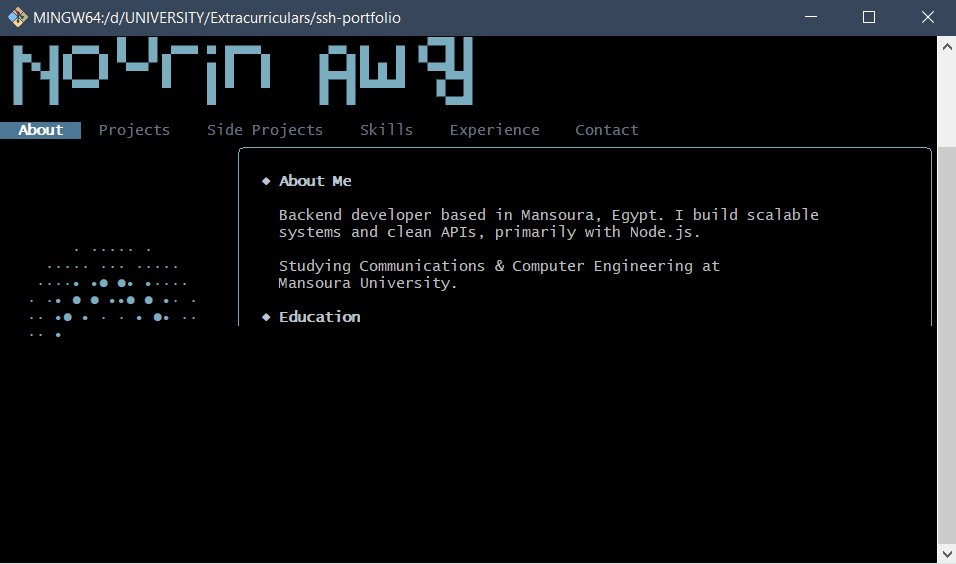

# ssh-portfolio

a terminal-based portfolio you can ssh into. built with go using [bubbletea](https://github.com/charmbracelet/bubbletea) and [wish](https://github.com/charmbracelet/wish).

```
ssh nourin.is-a.dev -p 2323
```



---

## ✦ what's inside

- **about** — background, education, extracurriculars
- **projects** — technical projects with highlights and links
- **side projects** — game dev and design work
- **skills** — languages, frameworks, tools
- **experience** — internships and roles
- **contact** — links and email

## ✦ navigating

| key | action |
|-----|--------|
| `← →` or `h l` | switch tabs |
| `↑ ↓` or `k j` | scroll / move cursor |
| `enter` | open project detail |
| `esc` | go back |
| `q` | quit |

## ✦ stack

- [bubbletea](https://github.com/charmbracelet/bubbletea) — TUI framework
- [wish](https://github.com/charmbracelet/wish) — SSH server middleware
- [lipgloss](https://github.com/charmbracelet/lipgloss) — terminal styling

## ✦ running locally

```bash
git clone https://github.com/nourinawadd/ssh-portfolio
cd ssh-portfolio
go run .
```

then in another terminal:

```bash
ssh localhost -p 2323
```

## ✦ windows

ssh may not render correctly in cmd or powershell. use [Windows Terminal](https://apps.microsoft.com/detail/9n8g5rfz9xk3) with openssh enabled, or [PuTTY](https://www.chiark.greenend.org.uk/~sgtatham/putty/).

---

[nourin.is-a.dev](http://nourin.is-a.dev) ✦ [linkedin](https://linkedin.com/in/nourinawad)
